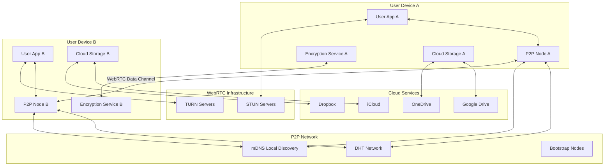
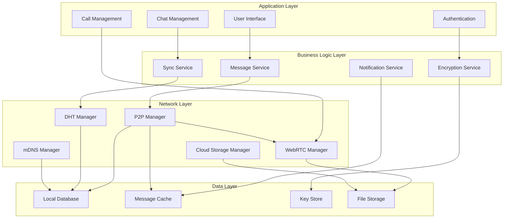

# Design Document

## Overview

Chain is a decentralized messaging platform that combines pure peer-to-peer networking and end-to-end encryption to create a censorship-resistant communication system. The architecture eliminates central servers entirely by using direct P2P connections between devices via WebRTC data channels, with peer discovery through DHT (Distributed Hash Table) and mDNS for local networks.

The system leverages the Signal Protocol for end-to-end encryption, WebRTC for both messaging (data channels) and real-time voice/video calls, and integrates with existing cloud storage services for media sharing. This design ensures zero infrastructure costs while maintaining enterprise-grade security and user experience comparable to centralized messaging platforms.

## Architecture

### High-Level System Architecture



### Core Components Architecture



## Components and Interfaces

### 1. P2P Manager

**Purpose**: Manages peer-to-peer connections, direct messaging, and network coordination.

**Key Interfaces**:
```kotlin
interface P2PManager {
  suspend fun startNode(): Result<NetworkInfo>
  suspend fun sendMessage(message: P2PMessage): Result<Unit>
  fun subscribeToMessages(): Flow<P2PMessage>
  fun getNetworkStatus(): Flow<NetworkStatus>
  suspend fun connectToPeer(peerId: String): Result<PeerConnection>
  suspend fun storeForwardMessage(message: P2PMessage): Result<Unit>
}

interface P2PMessage {
  val id: String
  val from: String
  val to: String
  val encryptedPayload: ByteArray
  val timestamp: Long
  val type: P2PMessageType
  val signature: ByteArray
}
```

**Implementation Details**:
- Uses WebRTC data channels for direct P2P communication
- Implements automatic reconnection with exponential backoff
- Maintains connection pool with reliability scoring
- Handles store-and-forward for offline message delivery
- Coordinates with DHT and mDNS for peer discovery

### 2. Encryption Service (Signal Protocol)

**Purpose**: Provides end-to-end encryption using the Signal Protocol's Double Ratchet algorithm.

**Key Interfaces**:
```typescript
interface EncryptionService {
  initializeSession(recipientId: string, preKeyBundle: PreKeyBundle): Promise<void>
  encryptMessage(plaintext: string, recipientId: string): Promise<EncryptedMessage>
  decryptMessage(ciphertext: EncryptedMessage, senderId: string): Promise<string>
  generatePreKeyBundle(): PreKeyBundle
  rotateKeys(): Promise<void>
}

interface EncryptedMessage {
  content: string
  type: MessageType
  keyId: string
  timestamp: number
}
```

**Implementation Details**:
- Implements Signal Protocol's X3DH key agreement
- Uses Double Ratchet for forward secrecy
- Manages identity keys, signed pre-keys, and one-time pre-keys
- Provides perfect forward secrecy and post-compromise security
- Handles key rotation and verification

### 3. DHT Manager

**Purpose**: Manages Distributed Hash Table for global peer discovery and routing.

**Key Interfaces**:
```kotlin
interface DHTManager {
  suspend fun bootstrap(bootstrapNodes: List<String>): Result<Unit>
  suspend fun publishPeer(key: String, value: String): Result<Unit>
  suspend fun findPeer(key: String): Result<String?>
  suspend fun discoverPeers(): Flow<Peer>
  fun observeDHTStatus(): Flow<DHTStatus>
}

interface DHTStatus {
  val isConnected: Boolean
  val routingTableSize: Int
  val knownPeers: Int
}
```

**Implementation Details**:
- Implements Kademlia DHT algorithm
- Uses public IPFS bootstrap nodes for initial network join
- Stores peer information indexed by phone hash or user ID
- Implements NAT traversal for peer connections
- Provides peer reputation tracking

### 4. WebRTC Manager

**Purpose**: Handles real-time voice/video communication AND P2P data channels for messaging.

**Key Interfaces**:
```kotlin
interface WebRTCManager {
  // Data Channels (for messaging)
  suspend fun createDataChannel(peerId: String): Result<DataChannel>
  suspend fun sendData(peerId: String, data: ByteArray): Result<Unit>
  fun observeDataChannel(): Flow<DataChannelMessage>

  // Media Calls
  suspend fun initiateCall(peerId: String, isVideo: Boolean): Result<CallSession>
  suspend fun acceptCall(callId: String): Result<CallSession>
  suspend fun endCall(callId: String): Result<Unit>
  suspend fun toggleMute(): Unit
  suspend fun toggleVideo(): Unit
}

interface CallSession {
  val id: String
  val participants: List<String>
  val isVideo: Boolean
  val status: CallStatus
  val localStream: MediaStream
  val remoteStream: MediaStream
}
```

**Implementation Details**:
- Uses WebRTC data channels for direct P2P messaging
- Uses WebRTC media streams for voice/video calls
- Implements ICE (Interactive Connectivity Establishment)
- Uses STUN/TURN servers for NAT traversal
- Handles codec negotiation and bandwidth adaptation
- Provides call quality monitoring and optimization
- Maintains persistent data channels for messaging

### 5. mDNS Manager

**Purpose**: Manages local network peer discovery using multicast DNS.

**Key Interfaces**:
```kotlin
interface MDNSManager {
  suspend fun startDiscovery(): Result<Unit>
  suspend fun stopDiscovery(): Result<Unit>
  suspend fun publishLocalPeer(peerInfo: Peer): Result<Unit>
  fun observeLocalPeers(): Flow<Peer>
}
```

**Implementation Details**:
- Uses JmDNS for multicast DNS service discovery
- Discovers peers on the same WiFi/LAN network
- Advertises local peer availability
- Provides instant local peer discovery (< 1 second)
- Works without internet connectivity

### 6. Cloud Storage Manager

**Purpose**: Integrates with cloud storage services for encrypted media sharing.

**Key Interfaces**:
```typescript
interface CloudStorageManager {
  uploadMedia(file: File, cloudService: CloudService): Promise<EncryptedLink>
  downloadMedia(link: EncryptedLink): Promise<File>
  deleteMedia(link: EncryptedLink): Promise<void>
  getStorageQuota(service: CloudService): Promise<StorageInfo>
  authenticateService(service: CloudService): Promise<AuthToken>
}

interface EncryptedLink {
  url: string
  encryptionKey: string
  service: CloudService
  expiresAt: Date
}
```

**Implementation Details**:
- Supports Google Drive, OneDrive, iCloud, and Dropbox APIs
- Encrypts files locally before cloud upload
- Generates time-limited access links
- Implements automatic cleanup of expired files
- Provides storage usage monitoring and optimization

### 7. Store-and-Forward Manager

**Purpose**: Manages offline message delivery through mutual peers.

**Key Interfaces**:
```kotlin
interface StoreForwardManager {
  suspend fun storeMessage(recipientId: String, message: P2PMessage): Result<List<String>>
  suspend fun retrieveMessages(): Result<List<StoredMessage>>
  suspend fun deliverStoredMessage(messageId: String): Result<Unit>
  suspend fun cleanupExpiredMessages(): Result<Int>
}

interface StoredMessage {
  val id: String
  val recipientId: String
  val encryptedMessage: P2PMessage
  val storedAt: Long
  val expiresAt: Long
  val attempts: Int
}
```

**Implementation Details**:
- Stores messages on 3 random mutual peers when recipient is offline
- Messages expire after 7 days
- Implements delivery retry with exponential backoff
- Automatically delivers when recipient comes online
- Provides delivery confirmation to sender

### 8. Local Database Manager

**Purpose**: Manages local message storage, caching, and search functionality.

**Key Interfaces**:
```typescript
interface DatabaseManager {
  storeMessage(message: Message): Promise<void>
  getMessages(chatId: string, limit: number, offset: number): Promise<Message[]>
  searchMessages(query: string): Promise<Message[]>
  deleteMessages(messageIds: string[]): Promise<void>
  syncWithBlockchain(): Promise<void>
}

interface Message {
  id: string
  chatId: string
  senderId: string
  content: string
  type: MessageType
  timestamp: Date
  status: MessageStatus
  replyTo?: string
  reactions: Reaction[]
}
```

**Implementation Details**:
- Uses SQLite with SQLCipher for encrypted local storage
- Implements full-text search with FTS (Full-Text Search)
- Provides message indexing and caching strategies
- Handles data synchronization across devices
- Implements automatic cleanup of old messages

## Data Models

### Core Data Structures

```typescript
// User Identity
interface User {
  id: string
  publicKey: string
  displayName: string
  avatar?: string
  status: UserStatus
  lastSeen: Date
  devices: Device[]
}

// Chat/Conversation
interface Chat {
  id: string
  type: ChatType // DIRECT, GROUP
  name: string
  participants: string[]
  admins: string[]
  settings: ChatSettings
  lastMessage?: Message
  unreadCount: number
  createdAt: Date
  updatedAt: Date
}

// Group-specific data
interface GroupChat extends Chat {
  maxMembers: number
  inviteLink?: string
  permissions: GroupPermissions
  description?: string
}

// Message types
enum MessageType {
  TEXT = 'text',
  IMAGE = 'image',
  VIDEO = 'video',
  AUDIO = 'audio',
  DOCUMENT = 'document',
  LOCATION = 'location',
  CONTACT = 'contact',
  POLL = 'poll',
  SYSTEM = 'system'
}

// Call data
interface Call {
  id: string
  chatId: string
  initiator: string
  participants: string[]
  type: CallType // VOICE, VIDEO
  status: CallStatus
  startTime: Date
  endTime?: Date
  duration?: number
}
```

### P2P Data Structures

```kotlin
// P2P message envelope
data class P2PMessage(
  val id: String,
  val from: String,
  val to: String,
  val encryptedPayload: ByteArray,
  val timestamp: Long,
  val type: P2PMessageType,
  val signature: ByteArray
)

// Peer information
data class Peer(
  val id: String,
  val address: String,
  val publicKey: String,
  val displayName: String?,
  val lastSeen: Long,
  val reliability: Double,
  val isOnline: Boolean
)

// Network status
data class NetworkStatus(
  val isConnected: Boolean,
  val connectedPeers: Int,
  val availablePeers: Int,
  val localDiscoveredPeers: Int,
  val globalDiscoveredPeers: Int,
  val activeConnections: Int
)
```

## Error Handling

### Error Categories and Strategies

1. **Network Errors**
   - Connection timeouts: Retry with exponential backoff
   - Peer unavailability: Route through alternative peers
   - Blockchain sync failures: Queue messages locally and retry

2. **Encryption Errors**
   - Key exchange failures: Prompt user for manual verification
   - Decryption failures: Request message resend
   - Key rotation issues: Reinitialize session

3. **Storage Errors**
   - Cloud storage failures: Fall back to local storage
   - Database corruption: Rebuild from blockchain history
   - Quota exceeded: Prompt user for cleanup

4. **Call Errors**
   - WebRTC connection failures: Fall back to TURN servers
   - Media device errors: Graceful degradation to audio-only
   - Bandwidth issues: Automatic quality adjustment

### Error Recovery Mechanisms

```typescript
interface ErrorHandler {
  handleNetworkError(error: NetworkError): Promise<void>
  handleEncryptionError(error: EncryptionError): Promise<void>
  handleStorageError(error: StorageError): Promise<void>
  recoverFromFailure(context: ErrorContext): Promise<RecoveryResult>
}

enum RecoveryStrategy {
  RETRY_WITH_BACKOFF,
  FALLBACK_TO_ALTERNATIVE,
  PROMPT_USER_ACTION,
  GRACEFUL_DEGRADATION,
  REINITIALIZE_COMPONENT
}
```

## Testing Strategy

### Unit Testing
- **Encryption Service**: Test Signal Protocol implementation, key generation, and message encryption/decryption
- **Blockchain Manager**: Test transaction creation, signing, and blockchain interaction
- **P2P Manager**: Test peer discovery, connection management, and message routing
- **Database Manager**: Test CRUD operations, search functionality, and data integrity

### Integration Testing
- **End-to-End Message Flow**: Test complete message journey from sender to recipient
- **Cross-Platform Sync**: Test message synchronization across different devices
- **Cloud Storage Integration**: Test file upload/download with all supported services
- **WebRTC Calling**: Test voice/video call establishment and quality

### Performance Testing
- **Message Throughput**: Test system performance with high message volumes
- **Group Chat Scalability**: Test performance with large group sizes (up to 100k members)
- **Blockchain Sync**: Test synchronization performance with network latency
- **Battery Usage**: Test power consumption optimization on mobile devices

### Security Testing
- **Encryption Validation**: Verify Signal Protocol implementation security
- **Key Management**: Test key storage, rotation, and recovery mechanisms
- **Network Security**: Test resistance to man-in-the-middle attacks
- **Data Privacy**: Verify no sensitive data leakage

### Test Automation Framework

```typescript
interface TestSuite {
  unitTests: UnitTest[]
  integrationTests: IntegrationTest[]
  performanceTests: PerformanceTest[]
  securityTests: SecurityTest[]
}

interface TestEnvironment {
  mockBlockchain: MockBlockchainNetwork
  mockCloudStorage: MockCloudServices
  testUsers: TestUser[]
  networkSimulator: NetworkSimulator
}
```

## Security Considerations

### Threat Model
1. **Passive Adversaries**: Cannot decrypt messages due to Signal Protocol encryption
2. **Active Network Attackers**: Cannot modify messages due to blockchain integrity
3. **Compromised Devices**: Limited impact due to forward secrecy and key rotation
4. **Government Censorship**: Resistant due to decentralized architecture

### Security Measures
- **Perfect Forward Secrecy**: Signal Protocol ensures past messages remain secure
- **Post-Compromise Security**: Key rotation limits impact of device compromise
- **Blockchain Integrity**: Cryptographic signatures prevent message tampering
- **Metadata Protection**: Minimal metadata exposure through decentralized routing

### Privacy Features
- **Disappearing Messages**: Automatic deletion after configurable time periods
- **Anonymous Routing**: P2P network obscures communication patterns
- **Local Data Control**: Users control their own data storage and backups

This design provides a comprehensive foundation for building the Chain messaging platform while ensuring security, scalability, and user experience comparable to centralized alternatives.
